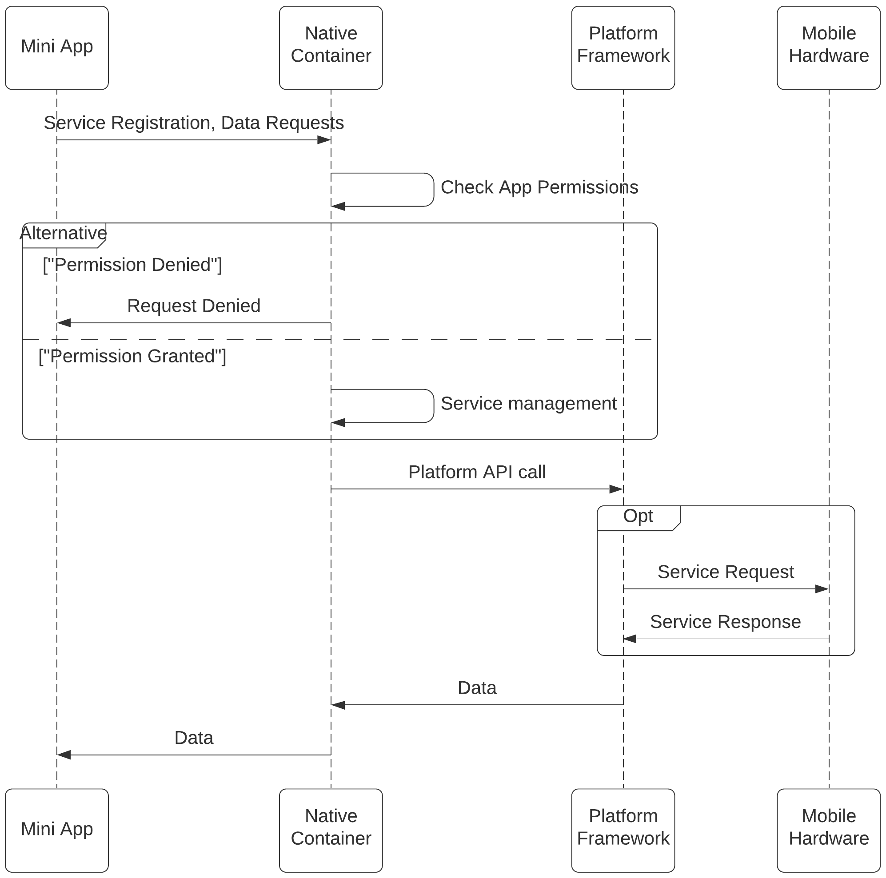

# del-container
Digital Enhanced Living service container app  
_This container application is still under development and features are constantly being added.
Additions may break existing functionality. Please refer to the development branch for the latest changes._

## Table of Contents
1. [About](#about)
2. [Architecture](#architecture)
3. [Container APIs](#container-apis)
4. [Currently Available Data](#currently-available-data)
5. [Examples](#examples)

## About
The Digital Enhanced Living (DEL) container (del-container) is the container application and one of the user modules for the DEL platform which handles micro health services. The service manages several micro applications and allows a user to use several health services from one single app. The container exposes several APIs that can be used to develop mini health applications for the container. Other services contributing to the platform include [__del-auth__](https://github.com/benphilip1991/del-auth), [__del-web__](https://github.com/benphilip1991/del-web) and [__del-api__](https://github.com/benphilip1991/del-api). Once developed, registration of apps is much like other commercial app stores - mini health applications for the platform can be registered with the del-api service which then becomes available to users on the platform. More details can be found on the service page.  
_Please note that the repositories may be private at the moment and will be made public as they are developed._  
_The [__del-api__](https://github.com/benphilip1991/del-api) service is required for the app to function. Once launched, the appropriate IP address/hostname and port have to be configured in the constants class (com.del.delcontainer.utils.Constants) in the container._  

## Architecture
The container is based on the following architecture -  
<p align="center"></p>

The figure shows four main components - the Application Manager, Data Manager, Conversation Manager and the Device Manager. These components are respoonsible for managing active mini-apps, handling the conversations with the bot, managing connected devices and user data.
Health data can be fetched from several sources including manual entry, from connected devices and even from other services. These can be divided into personal and environmental factors and are highlighted in the following figure -  

<p align="center"></p>

The following sequence diagram outlines a high level control and data flow within the container -  

<p align="center"></p>

_Please note that the current prototype implementation does not support all these metrics. They will be added as the container is developed further._

## Container APIs
As of now, the container exposes one interface for registering application details, data requests and callbacks. All mini applications must contain the function **setAppId** that accepts a string ID passed by the container when the mini app is launched. This ID must then be used for registering requests or calling any other functions offered by the container.

```
// Sample - setAppId accepts the id injected by the container 
// which is then used later
function setAppId(appId) {
    this.appId = appId;
    initApp();
}
```

The mini apps can request available data from the container (see [Currently Available Data](#currently-available-data)) and these requests can be registered with the container with a call to the **setCallbackRequest** function in DelUtils that accepts a JSON string with the app id injected by the container on app launch along with an array (**requests**) of JSON objects specifying the **resource** and the **callback** function the container should call once the data is available. The following example shows a request object - 
```
{
    "resource" : "access_pedometer",
    "callback" : "processStepCount"
}
```

In the above example, once the step count is available, the container will attempt to call the _processStepCount_ function in the mini app and pass it two parameters - the **data type** and the **data**, which can then be used as required. The following example shows a simplified flow of the above steps performed in a mini app - 

```
// Expose function to accept app id from the container
function setAppId(appId) {
    this.appId = appId;
    initApp();
}

// Initialize app and register requests for location and step count
function initApp() {
    let appRequest = {
        "appId" : this.appId,
        "requests" : [
            {
                "resource" : "access_pedometer",
                "callback" : "processStepCount"
            },
            {
                "resource" : "access_location",
                "callback" : "processLocation"
            }
        ]
    };
    DelUtils.setCallbackRequest(JSON.stringify(appRequest));
}

// Use step count data
function processStepCount(dataType, steps) {
    if ("step_count" == dataType) {
        // Do something
    }
}

// Use the location data
function processLocation(dataType, location) {
    if ("location" == dataType) {
        // Do something
    }
}
```  

Data private to a mini app can be stored through the container using the setAppData function which accepts the application id and a JSON string. The following example shows how 
```
function storeWorkoutData() {
    let appData = {
        // Application specific data stored in a separate file
    };

    DelUtils.setAppData(appId, appData);
}
```

Fetching stored data also follows a similar approach through the overloaded getData functions - 
|Function     | Description     |
|-------------|-----------------|
| getData(appId, type)   | Get app-specific data stored previously   |
| getData(appId, type, start-date, end-date)   | Get app-specific data stored previously filtered by date   |

The following example shows the use of the function to fetch stored location details -   
```
function getWorkoutData() {
    var appData = DelUtils.getData(appId,
    "access_location",
    startTime,
    endTime);

    // use appData as required
}
```

Similarly, a mini app can also push a notification to the user through the `createNotification` function - 
|Function          | Description      |
|------------------|------------------|
|createNotification(appId, notificationMessage)     | Push a notification through the container   |

The following example shows the use of the notification function - 
```
function pushAppNotification() {
    // App logic
    let notificationMessage = "Some notification...";
    DelUtils.createNotification(this.appId, notificationMessage);
}
```

_More details to come soon!_  


## Currently Available Data
The project is currently a research prototype and offers limited functionality for testing and usability evaluations. More features would be added as the platform is developed further. Currently, the container provides access to the following data - 

|Data Type           | Resource Key     | Update Interval |
|--------------------|------------------|------------------|
| Location           | `access_location` | 5s   |
| Step Count         | `access_pedometer` | 3s  |
| Heart Rate         | `access_heart_rate` | 5s |
| Accelerometer (Raw Data)      | `access_accelerometer` | 250ms |

The step count and heart rate are currently provided as numbers while the location and raw accelerometer data are injected as a JSON string with the relevant details. The location object provides the _latitude_, _longitude_ and _accuracy_, and the accelerometer data comprises the raw acceleration in the _X_, _Y_ and _Z_ planes.
By default, location updates are 
The following example demonstrates how this data can be extracted and used - 
```
// Handle accelerometer data
function accelerometerDataCallback(dataType, accelerometerData) {
    var accData = JSON.parse(data);
    if ("accelerometer" == dataType && Object.keys(accData).length > 0) {
        var X = accData.X;
        var Y = accData.Y;
        var Z = accData.Z;

        // do something
    }
}


// Handle location data
function locationCallback(dataType, locationData) {
    var coordinates = JSON.parse(location);
    if (dataType == "location" && Object.keys(coordinates).length > 0) {
        var lat = coordinates.latitude;
        var long = coordinates.longitude;
        var accuracy = coordinates.accuracy;
            
        // do something
    }
}
```

_Please note that platform only supports a Zephyr HXM heart rate monitor. More devices will be added shortly_  
_More details to come soon!_  


## Examples
The following gifs show a sample mini-health-app on the container.  

Installation
<p style="align:left"></p>  
  
Running  
<p style="align:right"></p>

Sample App Demo  
<video src="https://user-images.githubusercontent.com/33706460/151330252-6893c4c0-802a-44af-91c2-71b09c0741aa.MP4" width="30%" height="30%">

